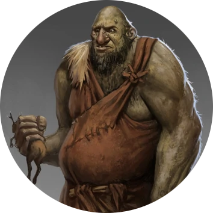

# The big not so friendly giant.

>"Crunch crunch, smek smek"

I could hear him before I could see him.
He has never learned how to eat properly, you could tell at first glance. 

And what he was eating *-bro, I couldn't stop laughing-* were the corpses of a hundred hairy dwarves he killed *-or so I suppose-* with his tiny spear 
that looked more like a tree without branches than a spear.

The gaint was roaming the forest with an eye for a spot for a midday nap where he came across the 
footsteps of a creature that has demolished every plant and tree and killed every living creature that had come across his way.

